# 🚀 Jet Engine Design Optimization – Aerospace Engineering Project  

---

## 🌟 **Project Overview**  

**🚀 Twin-Spool Jet Engine Optimizer 🚀**  
*🔥 Maximize thrust, minimize fuel – Revolutionizing commercial aircraft efficiency with MATLAB-powered simulations!*  

This project was developed as an **Aerospace Engineering Capstone (Jan 2023)**, focusing on designing and testing a twin-spool jet engine (α = 0) for optimal performance. Using MATLAB scripts, we simulate the design phase with carpet plots and analyze off-design conditions to push the boundaries of thrust and fuel efficiency.  

---

## 📈 **Key Features** 💡  

### 🎯 Design Phase Optimization
- Generate **carpet plots** for specific fuel consumption (SFC) vs. specific thrust  
- Select optimal design point: Overall pressure ratio (Π_c) and turbine inlet temperature (TIT)  
- Sensitivity analysis on pressure ratios and temperatures for peak performance  

### 🔧 Off-Design Performance Testing
- Simulate engine behavior at varying altitudes, Mach numbers, and conditions  
- Fixed turbine/nozzle geometry from design point  
- Iterative models for compressor operating lines and guide vane adjustments  

### 📊 MATLAB Simulations
- Codes for design (Carpet.m) and off-design (OffDesign_calcs_1/2_splitted.m) phases  
- Visualize efficiency curves, thrust variations, and SFC metrics  
- Includes PDF report with detailed calculations and figures  

### ⚡ Efficiency & Cost Savings
- Minimize SFC while maximizing specific thrust  
- Ideal for commercial aircraft: Reduces operational costs and boosts range  

---

## 🚀 **Technical Highlights**  

### ⚡ Advanced Aerospace Modeling
- Modular MATLAB code for thermodynamic cycles, Brayton cycle analysis, and polytropic efficiencies  
- Handles constants like γ (heat ratios), η (efficiencies), and h_pr (fuel heating value)  

### 🛡️ Robust Simulation Framework
- Backed by atmospheric models (atmosisa) and symbolic solving (syms)  
- Real-time parameter calculations: Mass flow rates, RPM, nozzle types, and geometries  

### 🌍 Tools & Compatibility
- Fully implemented in **MATLAB**  
- Compatible with engineering tools like Proteus or Simulink for extensions  
- PDF documentation for in-depth math and results  

---

## 🎨 **Workflow Diagram**

```mermaid
graph TD;
    A["Start: Define Flight Conditions"] --> B["Design Phase: Generate Carpet Plot"];
    B --> C["Select Optimal Point (Πc&#44; TIT)"];
    C --> D["Sensitivity Analysis: Vary Pressure &#38; Temp"];
    D --> E["Calculate Engine Specs: Thrust&#44; SFC&#44; Efficiency"];
    E --> F["Off-Design Phase: Fix Geometry"];
    F --> G["Iterate Conditions: Altitude&#44; Mach&#44; Tt4"];
    G --> H["Generate Operating Lines &#38; Plots"];
    H --> I["Output: Thrust vs Altitude&#44; SFC vs Thrust"];
    I --> J["Optimize for Efficiency"];

```

## 🌐 MATLAB Scripts & Usage

Carpet.m: Runs design phase simulations and plots SFC vs Thrust.
OffDesign_calcs_1_splitted.m: Handles first off-design case with relative parameters.
OffDesign_calcs_2_splitted.m: Simulates varying Mach/altitude with performance metrics.

Run in MATLAB: run('Carpet.m') for design plots.

## 💡 Future Enhancements

Integrate real-time CFD simulations for 3D engine modeling
Add AI/ML for predictive off-design optimization
Extend to turbofan variants with bypass ratios
